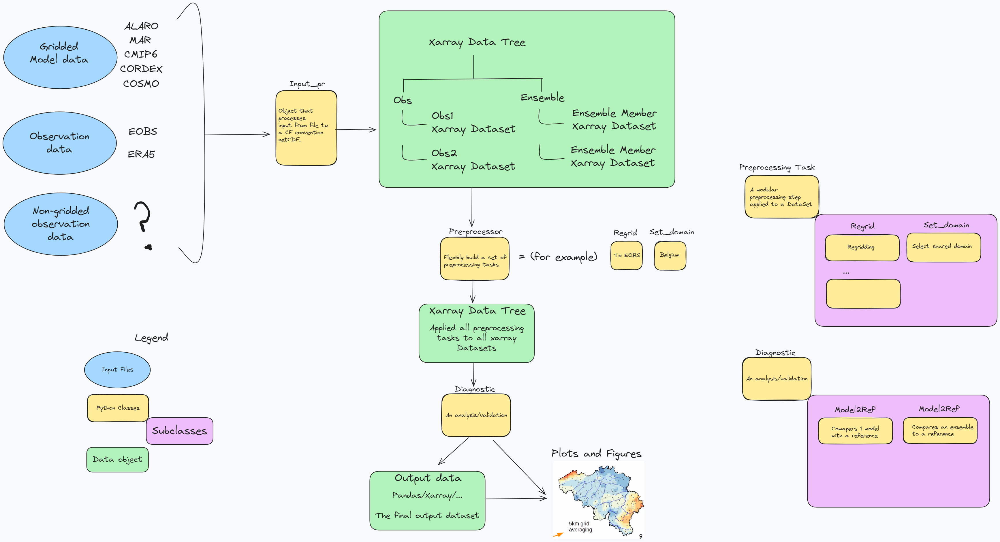

# ValEnsPy
A Python package to validate gridded model data.

## Documentation
As ValEnsPy is a private repository, the documentation is available in the docs folder.
To access the documentation, clone the repository,
```bash
git clone git@github.com:CORDEX-be2/ValEnsPy.git
```
and open the [index.html](docs/_build/index.html) file in your browser to explore the documentation.

## Installation

Go to the dev branch and follow the installation guide there. 

## Package structure

The package is structured as follows:


