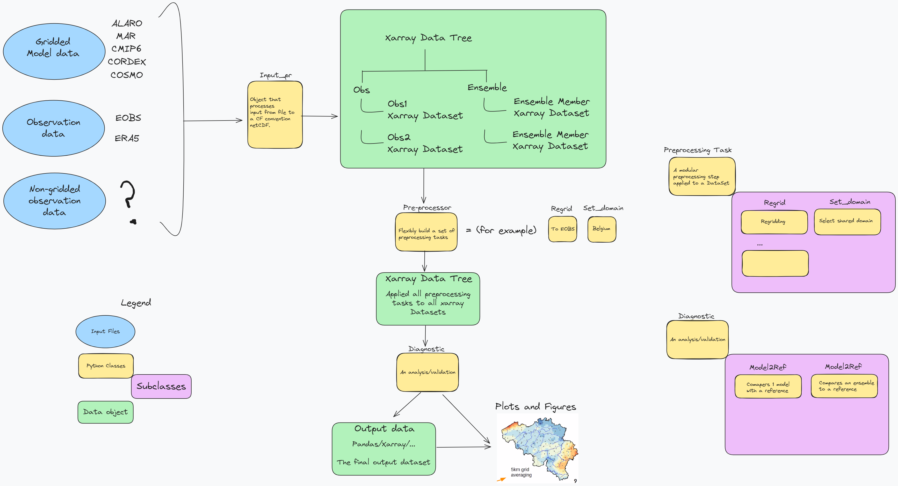

:html_theme.sidebar_secondary.remove:

ValEnsPy
============================

A Python package to validate gridded climate model data.

.. toctree::
   :hidden:
   :maxdepth: 5

   Home <self>
   Getting started <getting_started>
   Examples <doc_examples/index>
   Contributing <CONTRIBUTING.md>
   Contributing_VSC <CONTRIBUTING_VSC>
   Dev Notes <dev_notes>

.. container:: button

    :doc:`Getting started <getting_started>` :doc:`Contributing <CONTRIBUTING>`
    :doc:`Examples <doc_examples/index>` :doc:`Contributing VSC <CONTRIBUTING_VSC>`

Description
-----------

Some info on the package and the developers funding etc.

Indices and tables
----------------------

* :ref:`genindex`
* :ref:`modindex`
* :ref:`search`